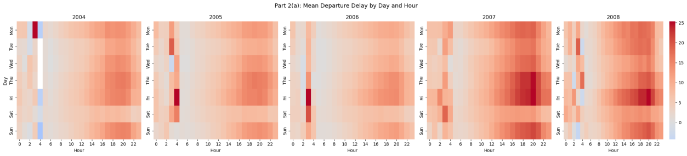

#  US Airline Flight Delay & Diversion Analysis (2004–2008)

Analysis of ~35 million US domestic flight records to answer three practical questions: **when should you fly to avoid delays**, **does aircraft age make delays worse**, and **can flight diversions be predicted** from scheduling and geographic data.

> 📄 **Full write-up:** [`report/Airline_Delay_Analysis_Report.md`](report/Airline_Delay_Analysis_Report.md)



---

## Overview

The 2009 ASA Statistical Computing and Graphics Data Expo dataset covers US commercial flights from October 1987 to April 2008 (~120M records, 12 GB uncompressed). This project uses a five-consecutive-year slice, **2004–2008**, and asks:

| # | Question |
|---|---|
| **(a)** | What are the best times and days of the week to minimise delays, each year? |
| **(b)** | Do older aircraft suffer more delays, year over year? |
| **(c)** | Can a logistic regression model predict the probability a flight is diverted, using departure date, scheduled times, origin/destination coordinates, distance, and carrier? |

**Data source:** [Harvard Dataverse — ASA Data Expo 2009](https://doi.org/10.7910/DVN/HG7NV7)

---

## Repository Structure

```
.
├── README.md
├── report/
│   ├── Airline_Delay_Analysis_Report.md   ← full formatted write-up
│   └── assets/                            ← figures used in the report
└── code/
    └── flight_delay_analysis.py           ← analysis script 
```

---

## Data Preparation

Because the raw dataset is too large to load in memory at once, each year's compressed CSV is read with `pandas.read_csv(usecols=...)`, restricting the load to 16 required columns, and numeric columns are downcast to smaller dtypes (`int8`/`int16`). Two reference tables are merged in:

- `plane-data.csv` → aircraft manufacture year (for aircraft age)
- `airports.csv` → airport latitude/longitude (for the diversion model)

Cancelled flights and rows with missing delay values are dropped, and implausible aircraft ages (< 0 or > 40 years) are filtered out. Full details and the complete cleaning table are in the [report](report/Airline_Delay_Analysis_Report.md#2-data-loading--cleaning).

---

## Methodology & Key Findings

### (a) Best time & day to fly
Mean departure delay was grouped by `(Year, Hour)` and `(Year, DayOfWeek)`, plus a combined heatmap of both.

- **Best window:** 04:00–06:00 departures, every year — delays build progressively through the day and peak 17:00–20:00.
- **Best days:** Saturday (2004, 2005, 2007), Tuesday (2006), Wednesday (2008) generally lower-traffic days. Friday and Sunday are consistently worst, driven by leisure-travel peaks.

### (b) Aircraft age vs. delay
Aircraft age (`Flight Year − Manufacture Year`) was computed via a `TailNum` merge with `plane-data.csv`, and correlated against `ArrDelay` per year.

- **Finding:** Pearson **r stays within ±0.01 in every year** (2004–2008) — no meaningful relationship between aircraft age and delay.

### (c) Predicting flight diversions
A separate standardized logistic regression (`class_weight='balanced'` to handle the rare-event imbalance) was fit per year on scheduling, geographic, distance, and one-hot encoded carrier features.

- **Finding:** Coefficient patterns are broadly **stable from 2004–2008** — distance and destination longitude show the strongest, most consistent positive association with diversion probability.

Full methodology, figures, and per-year tables are in the [full report](report/Airline_Delay_Analysis_Report.md).

---

## Tech Stack

- **Data wrangling:** `pandas`, `NumPy`
- **Visualization:** `Matplotlib`, `Seaborn`
- **Modelling:** `scikit-learn` (`LogisticRegression`, `StandardScaler`)
- **Reproducibility:** fixed random seed (`42`) throughout

---

## Reproducing the Analysis

1. Download the 2004–2008 yearly CSVs plus `airports.csv` and `plane-data.csv` from the [Harvard Dataverse](https://doi.org/10.7910/DVN/HG7NV7).
2. Update the data directory path at the top of `code/flight_delay_analysis.py` to point to your local copy.
3. Install dependencies:
   ```bash
   pip install pandas numpy matplotlib seaborn scikit-learn
   ```
4. Run the script:
   ```bash
   python code/flight_delay_analysis.py
   ```
   Figures are saved as PNGs in the working directory and also displayed inline.

> ⚠️ The uncompressed dataset is ~12 GB. The script reads each year's file with a restricted column set and downcast dtypes to keep memory usage manageable — see the [Data Preparation](#data-preparation) notes above.

---

## References

- American Statistical Association (2009). *ASA Statistical Computing and Graphics Data Expo 2009.* Harvard Dataverse. https://doi.org/10.7910/DVN/HG7NV7
- McKinney, W. (2010). *Data Structures for Statistical Computing in Python.* Proceedings of the 9th Python in Science Conference.
- Pedregosa, F. et al. (2011). *Scikit-learn: Machine Learning in Python.* JMLR, 12.
- Hunter, J.D. (2007). *Matplotlib: A 2D Graphics Environment.* Computing in Science & Engineering.
- Waskom, M. (2021). *Seaborn: Statistical Data Visualization.* JOSS, 6(60).
- Harris, C.R. et al. (2020). *Array programming with NumPy.* Nature, 585.

---

## Course Context

Completed as coursework for **ST2195 – Programming for Data Science**. The original assignment also included a Markov Chain Monte Carlo (Random Walk Metropolis) component, which is intentionally excluded here and tracked as a separate project.

*Author: Kennith Babu*
